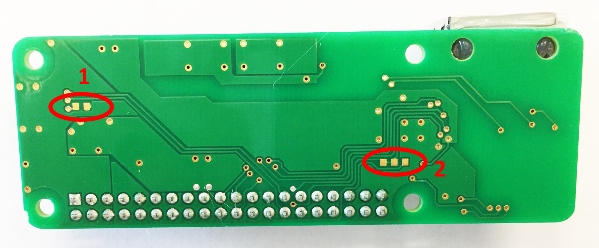

# RPi Power-over-Ethernet Hat

Give your RPi-0 ethernet and Power-ver-Ethernet (POE).  The hat uses the ENC28J60 chipset from Microchip to provide an 10Base-T 802.3af compatible interface for your RPi over SPI. The board negotiates power from your POE-enabled switch shared between 5V and 3.3V outputs at up to 9 Watts.

## Hardware Overview

## Configuring your RPi

For the latest Raspbian image, go to https://www.raspberrypi.org/downloads/raspbian/. 

## Files and Directories

`hardware/RPI0E.sch` - Eagle CAD schematic for the hat.
`hardware/RPI0E.brd` - Eagle CAD board for the hat.
`hardware/bom.xlsx` - Spreadsheet with bill of materials
`hardware/datasheets/` - datasheets for the board components, as well as some part drawings.

For information on EEPROM configuration visit https://github.com/raspberrypi/hats .
